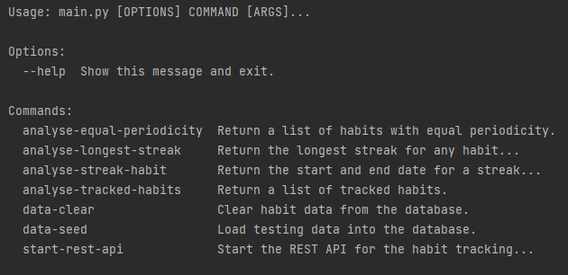
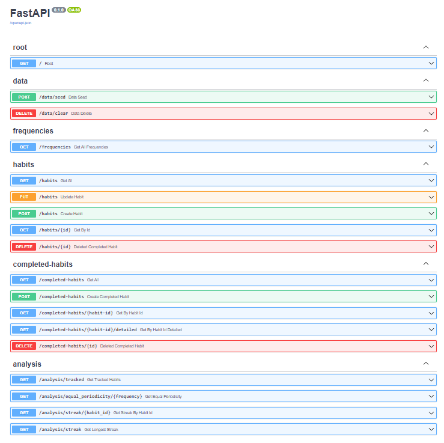
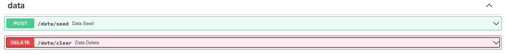
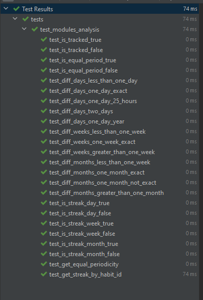

# Habit Tracking Application

## 1. Overview

Everybody wants to stop unhealthy habits and create good habits in its place. They are turning to technology for assistance to achieving this. I was tasked to create a backend for a habit tracking application that will assist users to achieve their goals.

## 2. Running the project

### 2.1 Prerequisites

**Python 3.7** or later. (Python 3.10.3 was used for development). Download the latest version [here](https://www.python.org/downloads/)

### 2.2 Installing the project

- Open CommandPrompt on Windows or Terminal on Mac after cloning the project from github
- Go to the root folder (**OOFPP-Habits-Phase3**) of the project where you will see a setup.py file
- Run the following command

  ```
  pip install .
  ```

- If you see `Successfully installed OOFPP-Habits-Phase3-1.0` the application is ready to be used.

## 3. Using the project

### 3.1 Running the cli

From the _CommandPrompt_ or _Terminal_ window, go to the _habits_backend_ folder (**OOFPP-Habits-Phase3**) of the application.
Run the following command to see the cli help menu.

```
python main.py --help
```

You should see the following help menu



**To load or clear the test data, you can run the following commands**

```
data-clear
data-seed
```

**Analysis cli commands**

_Show all the tracked habits_ (Habit that was completed at least once)

```
python main.py analyse-tracked-habits
```

_Habits with the same periodicity_ ('daily','weekly','monthly')

```
python analyse-equal-periodicity --frequency daily
```

_Longest streak for a habit_

```
python main.py analyse-streak-habit --habit_id 1
```

_Longest streak for any habit_

```
python main.py analyse-longest-streak
```

### 3.2 Start Rest API (Swagger UI)

From the _CommandPrompt_ or _Terminal_ window, go to the _habits_backend_ folder (**OOFPP-Habits-Phase3**) of the application.
Run the following command to run the REST API.

```
python main.py start-rest-api
```

To see the OpenAPI documentation browse to
http://127.0.0.1:8000/docs



You can use the _seed_ and _clear_ methods under data to load/clear testing data



## 4. Testing

Tests was created using _pytest_. To run the tests, follow the following steps

- Open a CommandPrompt or Terminal window
- Go to the **tests** folder in the root (**OOFPP-Habits-Phase3**) of the application
- To execute the all the analysis tests, run the following command

  ```
  pytest test_modules_analysis.py
  ```

  

- To execute the all the cli tests, run the following command

  ```
  pytest test_main.py
  ```

- To run individual tests, run the following commands
  ```
  pytest test_modules_analysis.py::test_is_tracked_true
  pytest test_modules_analysis.py::test_is_tracked_false
  pytest test_modules_analysis.py::test_is_equal_period_true
  pytest test_modules_analysis.py::test_is_equal_period_false
  ```

## 6. Calculation rules for a Streak

- Day:
  - Less than or equal to 1 day is counted as a day.
  - Hours, minutes and seconds are ignored.
  - If the day count is more than 1, we know the streak was broken
- Week:
  - Less than or equal to 7 days is treated as a week.
  - Hours, minutes and seconds are ignored.
  - If the week count is more than 1, we know the streak was broken
- Month
  - Less than or equal to a month is treated as a month
  - Days, hours, minutes and seconds are ignored.
  - If the year count is more than 1, we know the streak was broken

